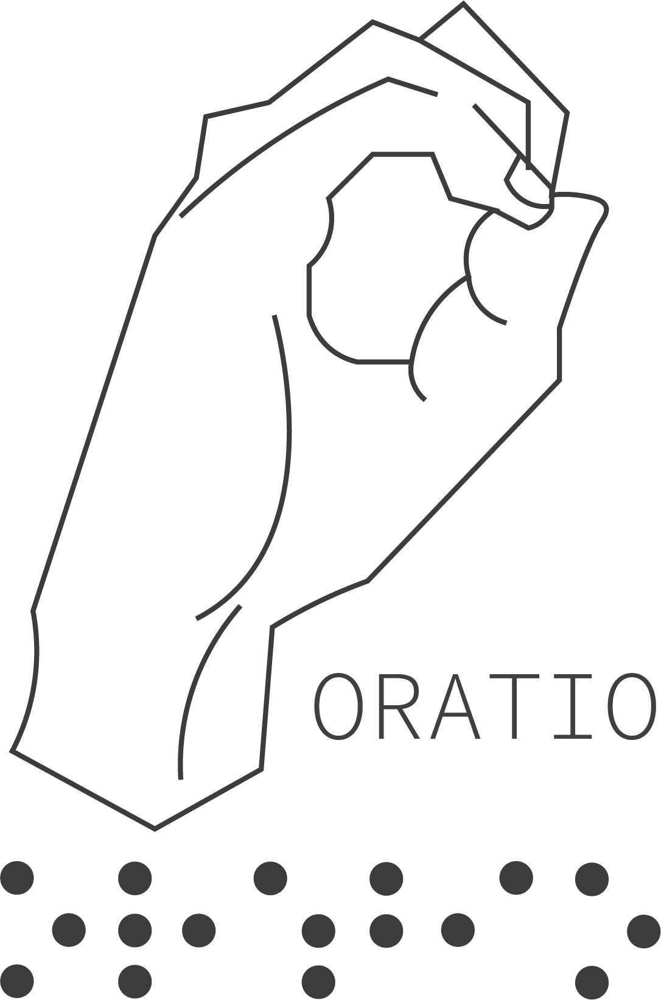

# ORATIO

## Descripción

ORATIO es una plataforma dedicada a la enseñanza del lenguaje de señas para hispanohablantes. El objetivo principal es proporcionar recursos accesibles, interactivos a el público interesado en aprender el lenguaje de señas, ya sea por motivos personales, profesionales o educativos.

## Problematica

Este proyecto ha sido implementado, debido a la falta de interes en las personas para aprender el lenguaje de señas, pues bien se sabe que a pesar de la no tan constante coincidencia de encontrarnos en una situación donde utilicemos esta habilidad, las barreras de comunicación entre personas sordas y oyentes dificultan la integración y la inclusión social.

## Propuesta de Solución  

Es por ello que hemos decidido desarrollar una página web intuitiva y accesible, disponible en varios dispositivos, que ofrezca cursos de lenguaje de señas, esta plataforma tendrá contenido educativo en focado en la comunicación efectiva entre ambos bandos.

## Objetivo General

Como objetivo general , hemos establecido lo siguiente: 

>Realizar una página web que permita al usuario aprender y consientizar sobre el uso del lenguaje de señas mediante actividades designadas.

## Objetivos Específicos

1. Desarrollar una interfaz de usuario intuitiva y accesible para dispositivos móviles o de escritorio.
2. Proveer materiales educativos actualizados.
3. Implementar programas de tutoría que mejoren el conocimiento del usuario.
4. Integrar herramientas de análisis para monitorear el comportamiento y progreso del usuario.
5. Permitir al usuario generar una cuenta que sea accesible en todo momento.

## Identidad Gráfica

| Logo de la Empresa | Logo del Producto | Paleta de colores |
| ------------------------------- | ------------------------------- | ------------------------------- |
|  |  |  |

## Lista de Tecnologás

- Servidor:  
- Pruebas: 
- Cliente:   
- Documentación: 

## Autores

**Gerente de Proyecto:** 
- [Josué Atlai Martínez Otero.](https://github.com/Josue-Martinez-Otero)

**Desarrolladores Web:** 
- [Yáred Amaury Romero Martínez.](https://github.com/AmauryRomero1285)
- [Uriel Abdalah Torres Medina.](https://github.com/UrielMedina0302)
- [Marcos de Jesús Ríos Durán.](https://github.com/Marcos-Jesus-Rios-Duran)
- [Josué Atlai Martínez Otero.](https://github.com/Josue-Martinez-Otero)
  
**Diseñador UI/UX:** 
- Juvenal Viveros.
  
**Expertos en Lenguaje de Señas:** 
- Consultores y creadores de contenido educativo.

