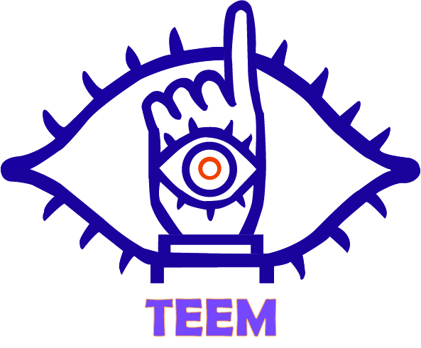
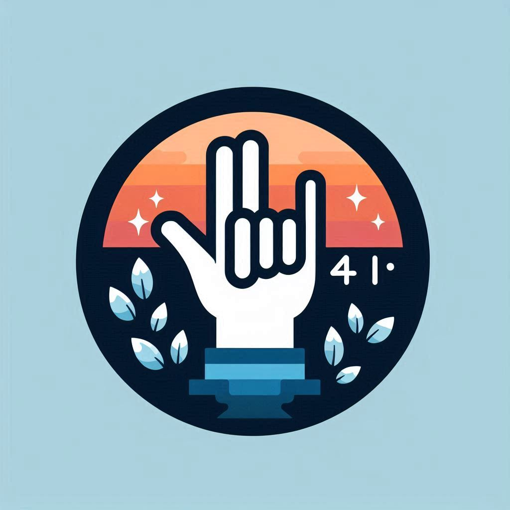
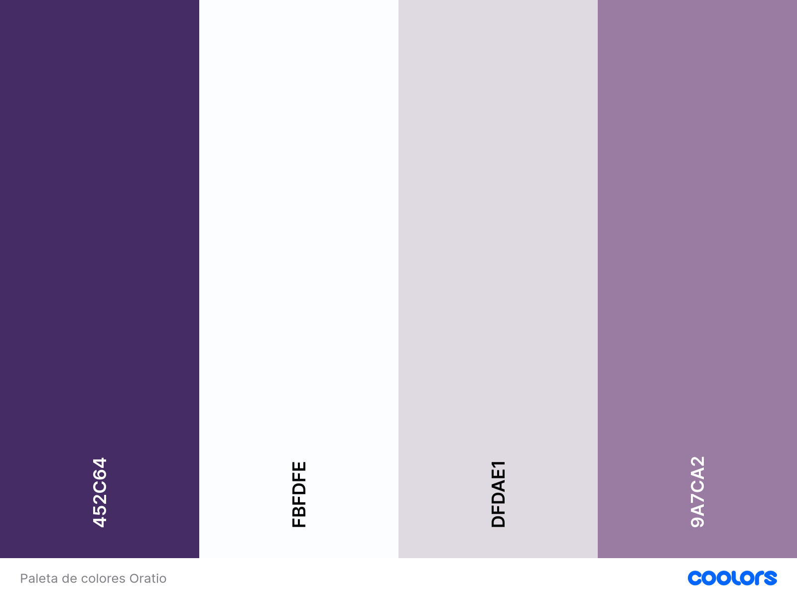

# ORATIO

## Descripción

**ORATIO** es una plataforma dedicada a la enseñanza del lenguaje de señas para hispanohablantes. El objetivo principal es proporcionar recursos accesibles e interactivos al público interesado en aprender el lenguaje de señas, ya sea por motivos personales, profesionales o educativos.

## Problemática

La falta de interés en las personas para aprender el lenguaje de señas. A pesar de no encontrarnos constantemente en situaciones que requieran esta habilidad, las barreras de comunicación entre personas sordas y oyentes dificultan la integración y la inclusión social.

## Propuesta de Solución

Es por ello que se ha decidido desarrollar una página web que sea intuitiva y accesible, disponible en varios dispositivos, que ofrezca cursos de lenguaje de señas. Esta plataforma estará centrada en mejorar la comunicación efectiva entre ambos grupos.

## Objetivo General

Como objetivo general, hemos establecido lo siguiente:

> Realizar una página web que permita al usuario aprender y concientizar sobre el uso del lenguaje de señas mediante actividades designadas.

## Objetivos Específicos

1. Desarrollar una interfaz de usuario intuitiva y accesible tanto como para los dispositivos móviles como para los de escritorio.
2. Proveer materiales educativos actualizados.
3. Implementar programas de tutoría que mejoren el conocimiento del usuario.
4. Integrar herramientas de análisis para monitorear el comportamiento y progreso del usuario.
5. Permitir al usuario generar una cuenta accesible en todo momento.

## Identidad Gráfica

| Logo de la Empresa | Logo del Producto | Paleta de colores |
| ------------------------------- | ------------------------------- | ------------------------------- |
|  |  |  |

## Lista de Tecnologás

- Servidor:  
- Pruebas: 
- Cliente:   
- Documentación: 

## Autores

**Gerente de Proyecto:** 
- [Josué Atlai Martínez Otero.](https://github.com/Josue-Martinez-Otero)

**Desarrolladores Web:** 
- [Yáred Amaury Romero Martínez.](https://github.com/AmauryRomero1285)
- [Uriel Abdalah Torres Medina.](https://github.com/UrielMedina0302)
- [Marcos de Jesús Ríos Durán.](https://github.com/Marcos-Jesus-Rios-Duran)
- [Josué Atlai Martínez Otero.](https://github.com/Josue-Martinez-Otero)
  
**Diseñador UI/UX:** 
- Juvenal Viveros.
  
**Expertos en Lenguaje de Señas:** 
- Consultores y creadores de contenido educativo.

