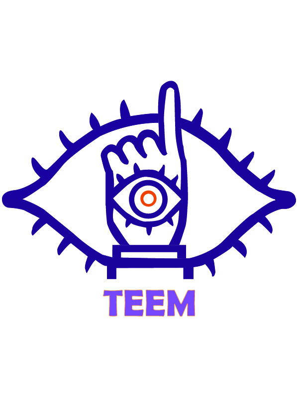

# ORATIO

### Descripción
ORATIO es una plataforma dedicada a la enseñanza del lenguaje de señas para hispanohablantes. El objetivo principal es proporcionar recursos accesibles, interactivos a el público interesado en aprender el lenguaje de señas, ya sea por motivos personales, profesionales o educativos.

| Logotipo de la Empresa                                        | Logotipo del Producto                                              |
| |  )|
|--------------------------------------------|------------------------------------------|

